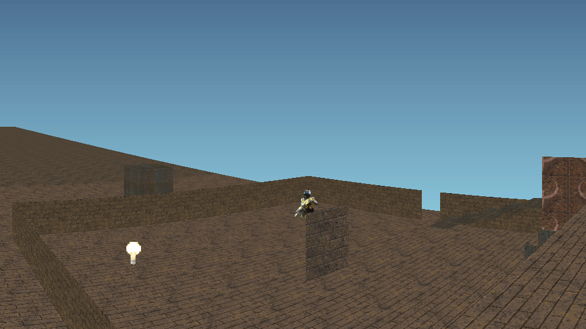
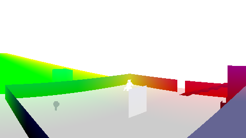
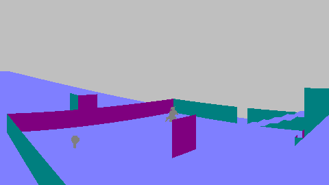
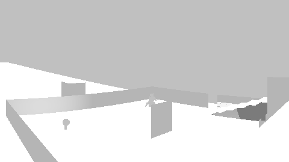
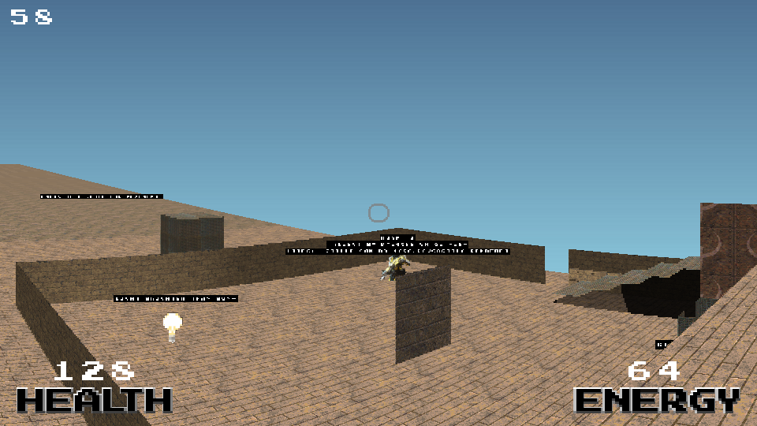

# Raycasting Renderer
## _Branch: GPU_

## Overview
This project aims to recreate a DOOM style renderer using modern OpenGL functionality, within shaders. I have emphisis on adding features that make the project more technically or visually interesting, first and foremost.

The project has full key-rebinding support, options changing (both via `userConfig.xml`), custom stages (using the xml format present in `/stages/`, also allowing for a folder of the same name to be created to store model or texture data specific to this stage) and so on.

Textures must be in the PNG format, with a resolution of `128x128`. There can be a maximum of 64 textures in a stage at any time. Skyboxes are `512x256` textures, and, when `VIEW_VLOOK` is disabled, take up the full `Y` space of the screen. `X` is determined on individual fragment direction in the `XY` plane, from `-180` to `180` degrees.

`Displacements` can be auto-created by adding a `<model />` node in a stage xml file. This will load an OBJ file in the stage file's assets folder. It is not recommended to add many models, and exceeding 1000-2000 `Displacements` will adversely affect performance. These `Displacements` cannot be collided with, and do render faster than `Walls` or even `Visplanes` so can be used to create distant geometry cheaper.

## The CPU-Side
### _Flags_
There are 256 assignable flag index values. These are boolean values stored in a project-wide array, and can affect "Specials". "Specials" are `Walls` or `Visplanes` which can move, interact with the player, or so on. The `IOPtr` value on these objects in the stage XML file correspond to the relevant flag index. `extra` usually relates to distance to move depending on `type`, or amount to hurt player per tick for example.

### _Movement_
The player can;
- Slide by walking/running and then holding the crouch key.
- Double jump via pressing jump again while airborne
- Airstrafe by moving in a non-forward direction while airborne (similar to, but not the same as Quake/Source)

### _Types_
Walls;
- Perfectly vertical, 2D lines.
- Infinitely thin.
- Has constant height.
- Textured from 3D position.
- Expensive to render.

Visplanes;
- Perfectly horizontal, rectangular.
- Infinitely thin.
- Has constant height.
- Textured from 3D position

Displacements;
- 3D triangles.
- No physics collision.
- Cheap to render.
- Textured from barycentric UV.

Sprites;
- Always face camera.
- Always face light sources.
- Cylindrical collision. (or none)
- Textured from width/height values.

Lights;
- Point-sources.
- Constant colour.
- Can be dynamically enabled/disabled via flags.
- Expensive to render.

TextObjects;
- Sprite-like labels.
- Can only use up to 64 Alphanumeric characters per TO, plus a few extra symbols: `-.!?,'/:;&^`
- Always fully lit.
- Very expensive to render, when numerous.

## The GPU-Side
### _environment.frag_
This shader draws the stage from the perspective of the player, using line intersection and 3D rasterisation techniques. `Walls` are perfectly vertical, infinitely thin lines with a given height. `Visplanes` are perfectly horizontal planes that span between two 2D positions. These are textured based on physical position of each fragment to allow textures to line up between `Walls`/`Visplanes`. `Displacements` are pseudo-3D triangles projected using the same system as `Sprites` and `TextObjects`, and use 3D rasterisation techniques to draw into the scene. These are textured using explicit vertex texture coordinates and barycentric mapping.

The textures all use `GL_NEAREST` sampling, but make use of mipmapping. The calculation for when to use each mip level is based on a minimum distance to the first mip change, the surface's slope and the actual distance. The texturing blends between mip levels providing a smoother transition. Without mipmapping, glancing angles on surfaces creates a shimmering look as differing pixels are sampled when the view moves. This is non-ideal, so mipmapping was added. This has the added benefit of allowing for a texture quality option.

The world is drawn in a pseudo-3D manner. `X, Y` are in perspective, and `Z` (vertical) is orthographic. This mimics the DOOM style of perfectly vertical walls and inability to look directly upward/downward.

### _sprites.frag_
This shader simply draws every sprite. They can have transparency, and for lighting purposes are treated as a singular point at their centre with no normal (always facing light source).

### _lighting.frag_
This shader is responsible for the scene's lighting. The aforementioned shaders draw into;

_An albedo map (`renderedFrame`)_

_A map of positions (`positionMap`)_

_And a map of normals (`normalMap`)_

_To create the final lightmap._

Using these three textures, it creates a lower resolution overlay of pixel lighting to be used later. This can contain lighting colours, shading, brightness and so on. The calculations utilise every light in the scene, the player's Headlamp (if enabled) and the sun (given as a direction and colour).

_The final result (produced later by `display.frag`) from the above maps._

The lighting map created is the only `GL_LINEAR` sampled `Image2D` in the entire project, as this allows the shadows to have softer edges.

### _interface.frag_
Responsible for the HUD, `interface.frag` draws to a smaller texture to be sampled later. This shader draws the HUD, and also every `TextObject` in the view as it has easy access to image-blitting functionality. The font used is "PressStart2P-Regular". Integer values can also be drawn, such as framerate (graphics), tickrate (physics), health and energy.

### _display.frag_
The only shader to have its own dedicated vertex shader, `display.frag` combines and shows the final frame. Using the albedo map, the lighting map and the UI texture, these are combined to create the final image visible onscreen. The shader also writes to another `Image2D`, as these "post-processing" style effects must appear in screenshots.
